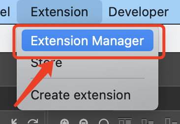
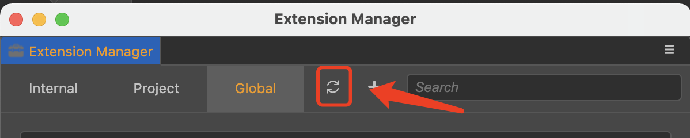
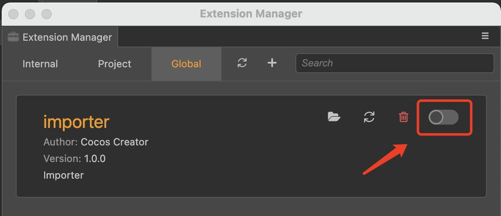

# plugin-import-2.x

[中文](https://github.com/cocos-creator/plugin-import-2.x/blob/main/readme/README.en.md)

This plugin is used to reduce the workload of developers upgrading 2.x projects to 3.0.0.

As the cocos creator does not currently support hot updates for plugins, if developers encounter problems with the plugin, they can quickly resolve them by following the tutorial below to update the plugin.

## How to update the plugin

1. Download [zip](https://github.com/cocos-creator/plugin-import-2.x/archive/v1.0.zip) or [tar.gz](https://github.com/cocos-creator/plugin-import-2.x/archive/v1.0.tar.gz) extension packages。

2. Store in the relevant designated location, as follows
    - To apply globally (all projects), just store the plugins folder under **User/.CocosCreator/extensions** (if you don't have one, you can create one yourself)
    - To apply to a single project, simply store the folder in the **extensions** folder at the same level as the **assets** file
    
> **Note**: If you don't have an **extensions** folder, you can create one yourself
    

3. Enable Extension
    
    1.Open Extension Manager via the main menu
    
    
    
    2.Click on the Refresh button
    
     
    
    3.Enable extension
    
    

## How to give feedback

1. [新建 **New issue** 反馈](https://github.com/cocos-creator/plugin-import-2.x/issues/new) 
2. [论坛反馈](https://forum.cocos.org/c/Creator)
